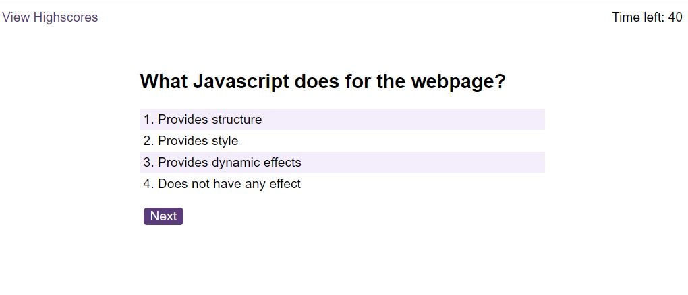
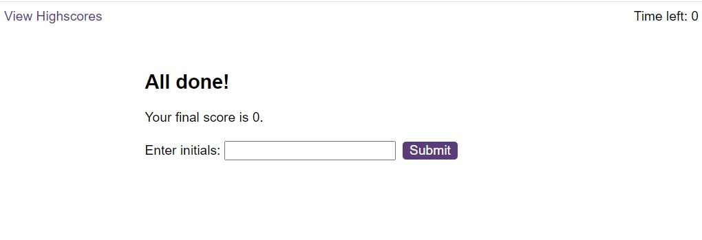
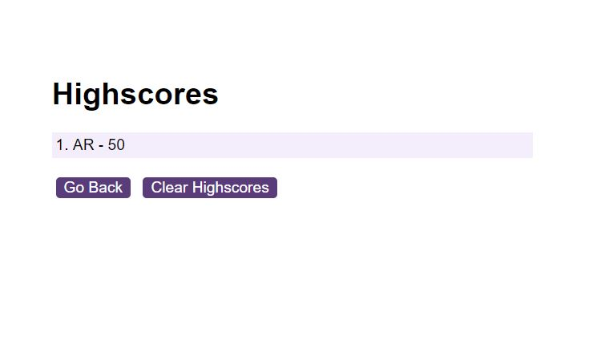

# Coding(JavaScript) timed quiz

## Description

This project is a short timed multiple choice JavaScript quiz with 4 possible answer options:

Once user selected an answer, they get a feedback, saying it is Correct or Wrong.

Quiz is timed. Each wrong answer takes away 10 seconds time from total available time.

If the time runs out before user answers all the questions - game is over and user is presented with the result:

User can enter their initials, submit and once they click on Highscores link on the top left, it shows saved initials and score:

I made this quiz to practice my JavaScript skills:
- manipulating DOM - adding and removing elements
- plan and execute my workflow
- plan and execute app logic
- use event listeners
- use functions (and find out they are not always working as I was expecting!)
- refactor the code
- use local storage

## Installation

There is no installation needed
## Usage

Please view deployed project [here](https://astarem.github.io/coding-quiz-timed/index.html) .